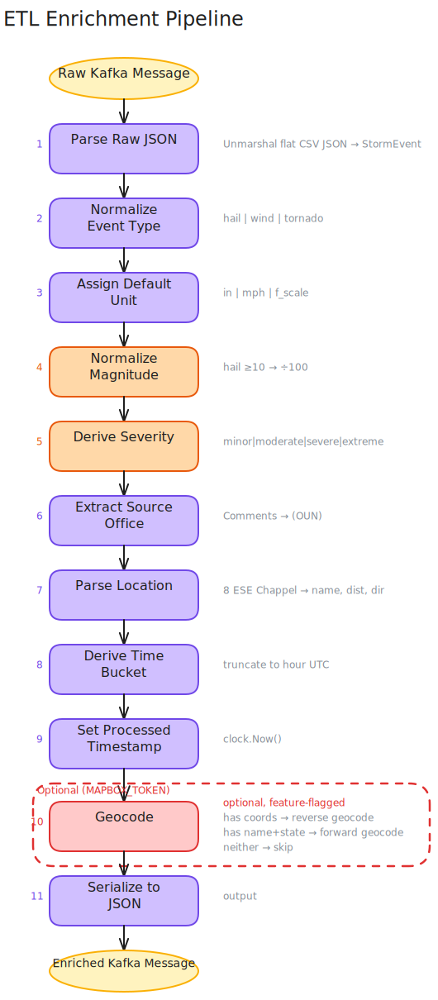
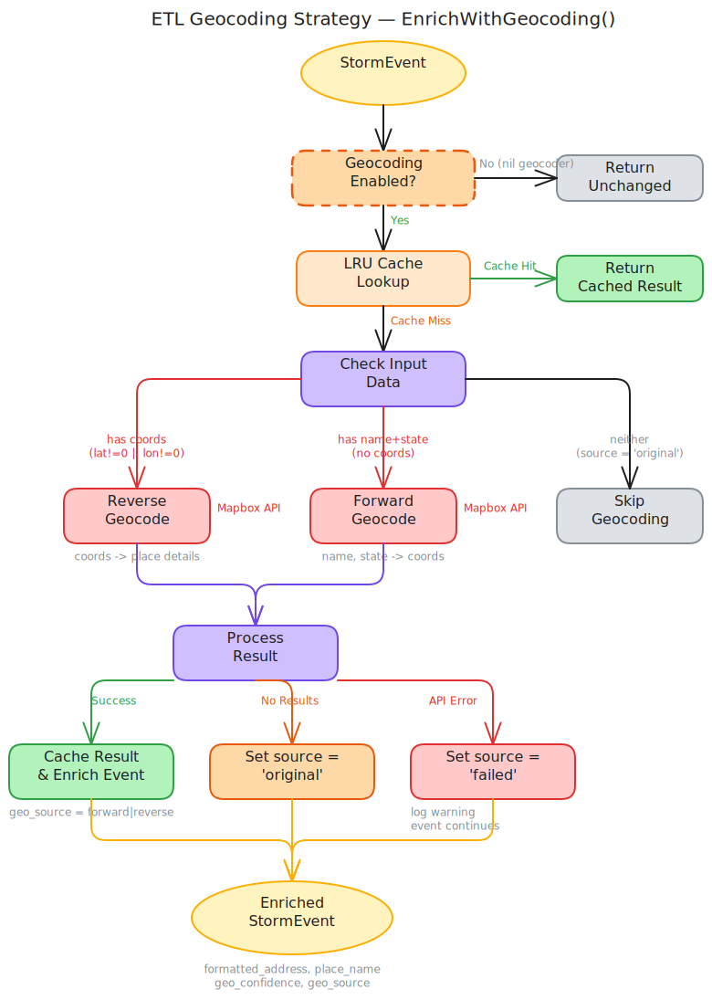

# Enrichment Rules

The transform stage applies a series of enrichment steps to each raw storm event. Core enrichment logic lives in `internal/domain/transform.go`, with geocoding enrichment in `internal/domain/geocode.go`.

## Pipeline

Each event passes through these steps in order:

1. **Parse** -- Deserialize raw JSON into a `StormEvent`
2. **Normalize event type** -- Case-insensitive mapping to canonical values
3. **Normalize unit** -- Default unit assignment per event type
4. **Normalize magnitude** -- Convert legacy hundredths format for hail
5. **Derive severity** -- Classify severity based on event type and magnitude
6. **Extract source office** -- Parse NWS office code from comments
7. **Parse location** -- Extract distance, direction, and place name from raw location string
8. **Derive time bucket** -- Truncate begin time to the hour (UTC)
9. **Set processed timestamp** -- Record when enrichment occurred
10. **Geocode** *(optional)* -- Forward or reverse geocode via Mapbox to enrich with `formatted_address`, `place_name`, `geo_confidence`, and `geo_source`
11. **Serialize** -- Marshal to JSON for the output topic

## Event Type Normalization

Exact match only. The event type is metadata added by the upstream service when converting CSV to JSON, so it is expected to already be normalized.

| Input | Output |
|---|---|
| `hail` | `hail` |
| `wind` | `wind` |
| `tornado` | `tornado` |
| anything else | `""` (empty) |

## Unit Defaults

If the input unit is empty, a default is assigned based on event type:

| Event Type | Default Unit |
|---|---|
| `hail` | `in` (inches) |
| `wind` | `mph` |
| `tornado` | `f_scale` |

If a unit is already provided, it is preserved (lowercased and trimmed).

## Magnitude Normalization

Handles a legacy data format where hail sizes were reported in hundredths of an inch:

- If `event_type == "hail"` AND `unit == "in"` AND `magnitude >= 10`: divide by 100
- Example: `175` becomes `1.75` inches
- Values below 10 are assumed to already be in inches and are left unchanged

## Severity Classification

Severity is derived from event type and magnitude. A magnitude of `0` produces no severity.

### Hail (inches)

| Magnitude | Severity |
|---|---|
| < 0.75 | minor |
| 0.75 -- 1.49 | moderate |
| 1.50 -- 2.49 | severe |
| >= 2.50 | extreme |

### Wind (mph)

| Magnitude | Severity |
|---|---|
| < 50 | minor |
| 50 -- 73 | moderate |
| 74 -- 95 | severe |
| >= 96 | extreme |

### Tornado (F/EF scale)

| Magnitude | Severity |
|---|---|
| 0 -- 1 | minor |
| 2 | moderate |
| 3 -- 4 | severe |
| >= 5 | extreme |

## Source Office Extraction

Extracts a 3-5 letter uppercase NWS office code from the end of the comments field.

Pattern: `(CODE)` at the end of the string, where `CODE` is 3-5 uppercase letters.

Examples:

- `"Large hail reported (ABC)"` -> `ABC`
- `"Heavy rain observed (ABCD)"` -> `ABCD`
- `"Storm reported"` -> `""` (no match)
- `"storm (abc)"` -> `""` (lowercase not matched)

## Location Parsing

Parses raw location strings in the format `<distance> <direction> <place>`.

Pattern: `^\d+(\.\d+)?\s+[NSEW]{1,3}\s+.+$`

Examples:

- `"5.2 NW AUSTIN"` -> name: `AUSTIN`, distance: `5.2`, direction: `NW`
- `"10.5 NNE SAN ANTONIO"` -> name: `SAN ANTONIO`, distance: `10.5`, direction: `NNE`
- `"AUSTIN"` -> name: `AUSTIN`, distance: `0`, direction: `""` (no match, raw value returned as name)

## Time Bucket

The `event_time` is truncated to the hour in UTC and formatted as RFC 3339.

Example: `2024-04-26T15:45:30Z` -> `2024-04-26T15:00:00Z`

## Geocoding Enrichment

When Mapbox geocoding is enabled (`MAPBOX_TOKEN` set), events are enriched with location data via forward or reverse geocoding. This step is handled by `EnrichWithGeocoding()` in `internal/domain/geocode.go`.

### Strategy

| Condition | Action |
|---|---|
| Coordinates missing, location name + state present | **Forward geocode**: resolve name to coordinates |
| Coordinates present | **Reverse geocode**: resolve coordinates to place details |
| No coordinates and no name/state | Skip geocoding |

### Result Fields

| Field | Description |
|---|---|
| `formatted_address` | Full place name returned by Mapbox (e.g., `"Austin, Texas, United States"`) |
| `place_name` | Short place name (e.g., `"Austin"`) |
| `geo_confidence` | Provider confidence score (0.0--1.0) |
| `geo_source` | How the coordinates were obtained: `"forward"`, `"reverse"`, `"original"`, or `"failed"` |

### Value Analysis

Based on the mock dataset (271 records from NOAA SPC 2024-04-26):

- **100% of records have coordinates** -- every event takes the reverse geocode path. Forward geocoding (name-to-coordinates) is unused in this dataset but remains available as a safety net for records missing coordinates.
- **83.8% have relative-direction locations** like "8 ESE Chappel" -- Mapbox replaces these with standardized addresses (e.g., "Chappel, San Saba County, Texas").
- **`confidence` is uniformly high (~1.0)** for reverse geocoding with precise coordinates. The confidence score provides discriminating value primarily for forward geocoding, where fuzzy name matching may produce lower scores.

The primary value of Mapbox enrichment is **address normalization** (`formatted_address`, `place_name`), not the confidence score. Approximately 70% of the value comes from replacing cryptic relative-direction locations with canonical, human-readable addresses suitable for cross-referencing with other geographic datasets.

### Graceful Degradation

Geocoding failures never block the pipeline. If the API call fails or returns no results:

- The event proceeds through the rest of the pipeline unchanged
- `geo_source` is set to `"failed"` (API error) or `"original"` (no results)
- A warning is logged with the event ID and error details

### Configuration

Geocoding is feature-flagged via environment variables. Setting `MAPBOX_TOKEN` auto-enables geocoding; `MAPBOX_ENABLED=false` overrides this.

| Variable | Default | Description |
|---|---|---|
| `MAPBOX_TOKEN` | *(empty)* | Mapbox API access token. **Secret -- do not commit.** |
| `MAPBOX_ENABLED` | auto | Explicit override. Auto-enabled when token is set. |
| `MAPBOX_TIMEOUT` | `5s` | HTTP timeout for Mapbox API requests. |
| `MAPBOX_CACHE_SIZE` | `1000` | Maximum LRU cache entries. |

**Local development**: Set `MAPBOX_TOKEN` in the gitignored `.env` file or export it in your shell.

**Docker Compose**: The token is passed from the host environment via the `environment` directive in `compose.yml`. Export `MAPBOX_TOKEN` before running `docker compose up` or `make up`.

**CI/CD**: `MAPBOX_TOKEN` is stored as a GitHub Actions secret and injected into the E2E workflow and smoke tests.

### Caching

Results are cached in an LRU cache (`MAPBOX_CACHE_SIZE`, default 1000 entries). Empty results (no `FormattedAddress`) are not cached so transient "not found" responses can be retried on the next occurrence.

### Testing

Geocoding has three layers of tests:

- **Unit tests** (`go test ./...`): Mock-based tests covering enrichment logic, client HTTP, cache behavior, and config validation. Run in CI on every push.
- **Smoke tests** (`make test-smoke`): Build-tag-gated tests (`//go:build mapbox`) that hit the real Mapbox API. Require `MAPBOX_TOKEN` in the environment. Run in CI on pushes to `main`.
- **E2E tests** (`make test-e2e`): Full stack tests that verify geocoding fields propagate through Kafka to the API's GraphQL endpoint.

## Output Event Format

The serialized output includes:

- **Key**: Event ID as bytes
- **Value**: Full `StormEvent` JSON (excludes `RawPayload`), including geocoding fields when available (`formatted_address`, `place_name`, `geo_confidence`, `geo_source`)
- **Headers**:
  - `type`: Normalized event type
  - `processed_at`: RFC 3339 timestamp of when enrichment occurred

## Related

- [API Data Model](https://github.com/couchcryptid/storm-data-api/wiki/Data-Model) -- downstream database schema and field mapping
- [System Data Flow](https://github.com/couchcryptid/storm-data-system/wiki/Data-Flow) -- end-to-end data journey from NOAA CSV to GraphQL
- [System Data Model](https://github.com/couchcryptid/storm-data-system/wiki/Data-Model) -- message shapes and event types across all services
- [[Architecture]] -- hexagonal design and enrichment pipeline
- [[Configuration]] -- Mapbox geocoding feature flags and settings
- [[Development]] -- testing enrichment rules (unit, smoke, E2E)
